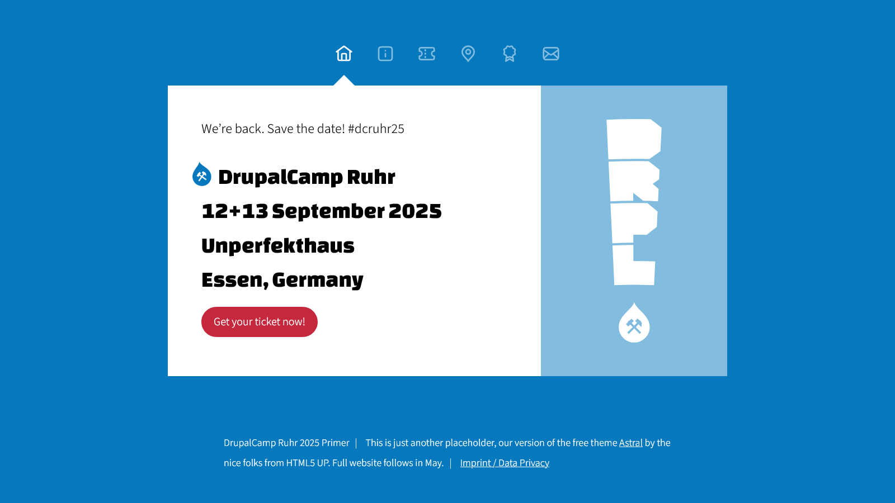

# DrupalCamp Primer

This is s simple static website we used for a few weeks for the [DrupalCamp Ruhr 2025](https://drupalcamp.ruhr/). It is meant to provide basic informations before the main site for the event is ready.

The site is a rewrite of the template [Astral on html5up.net](https://html5up.net/astral). It uses the fonts *Source Sans 3* and *Changa One* from [Google Fonts](https://fonts.google.com/). And some free icons from [Untitled UI](https://www.untitledui.com/free-icons).

Use it. Don’t use it. Change what you want. But if you keep the design, fonts and/or icons leave the credits for those items.

And don’t forget to change the favicon and opengraph image.

I put this online together with some [notes on organizing DrupalCamps (blogpost in German)](https://talesof.me/de/planung-drupalcamp).